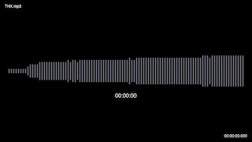
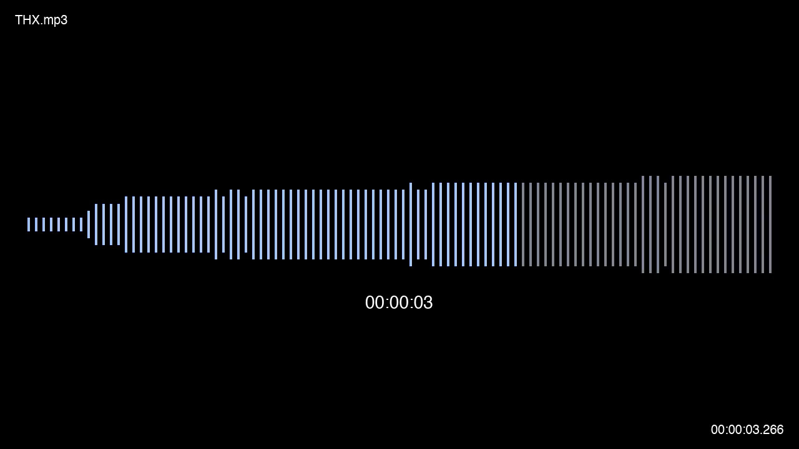
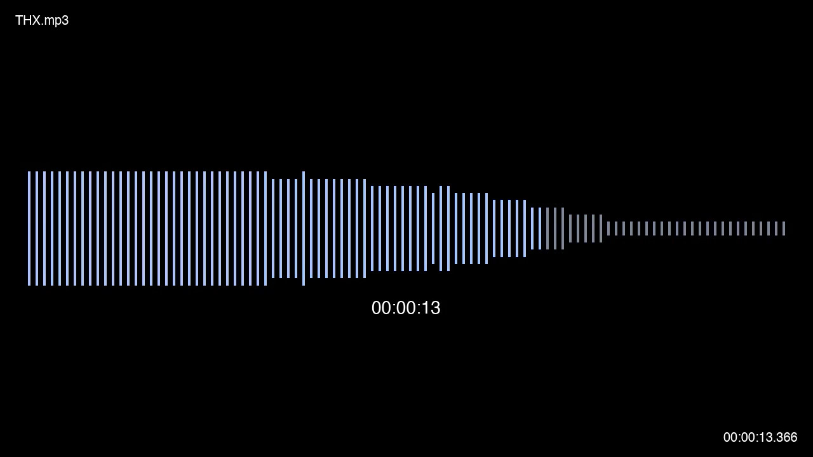
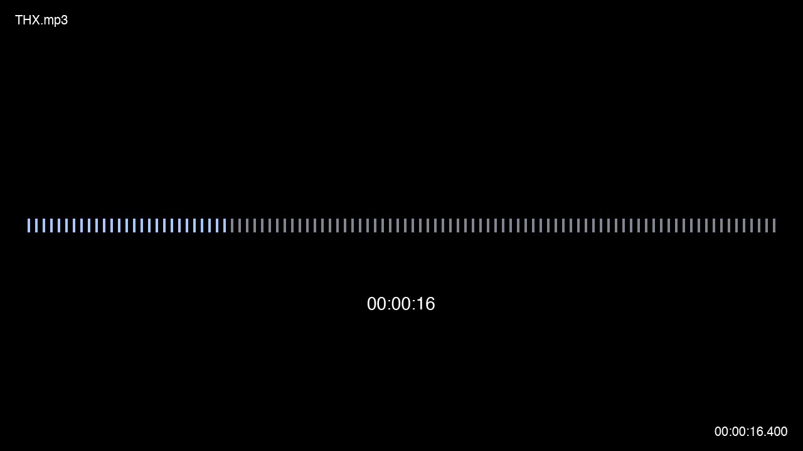

# Divortio - Audio Waveform

FFMPEG scripts to generate a stylized, animated audio waveform video, inspired by the
Google Recorder UI. 

The script analyzes any audio file and creates a video with a mirrored, quantized waveform that
animates in sync with the audio.

---

## Showcase

The scripts produce a clean, modern, and highly customizable visualization. The following samples were generated from
the provided `sample_thx.mp3` file.

### Final Video Output

[[Click to watch the final video output]](https://github.com/divortio/divortio-audio-waveform/raw/refs/heads/main/samples/sample_thx_waveform.mp4)

[](https://github.com/divortio/divortio-audio-waveform/raw/refs/heads/main/samples/sample_thx_waveform.mp4)


### Key Moments

| Crescendo & Peak Volume | Fade & Decay | Silence |
| :---: | :---: | :---: |
|  |  |  |

---

## Features

- **Mirrored Waveform**: Creates a vertically mirrored (reflected) audio waveform for a dynamic, symmetric look.
- **Animated Color Wipe**: The waveform bars smoothly change from a dim "unplayed" color to a bright "played" color,
  synchronized with the audio playback.
- **Quantized "Binned" Visuals**: The height of each waveform bar is quantized into a set number of levels, creating a
  clean, stylized, non-literal representation of the audio.
- **Bar Styling**: Full control over the number of bars, their width, and the spacing between them.
- **Chunk-Based Processing**: The script processes audio in 5-second chunks, resetting the waveform view for each new
  segment, making it suitable for audio of any length.
- **Optional Metadata Overlays**: Dynamically render the filename and multiple timecode formats directly into the video.
- **Parallel Processing**: Automatically processes the 5-second chunks in parallel to drastically speed up rendering
  time on multi-core systems.

---

## Prerequisites

Before you begin, ensure you have the following installed on your system:

- **`bash`**: The scripts are designed to be run in a Bash environment.
- **`ffmpeg` & `ffprobe`**: The core of the project. Version 4.x or newer is required.
- **`bc`**: A command-line calculator, used by the scripts for floating-point math.

For the optional metadata overlays, you will also need to provide a path to a font file (e.g., `.ttf`).

---


## File Structure

The repository should be structured as follows for the scripts to work correctly.

```

├── samples/
│   ├── sample_thx.mp3
│   ├── sample_thx_silence.jpg
│   ├── sample_thx_waveform_fade.jpg
│   ├── sample_thx_waveform.jpg
│   └── sample_thx_waveform.mp4
├── src/
│   ├── create_waveform_video.sh
│   └── process_chunk.sh
└── README.md

```

## Usage

1. **Make the scripts executable:**
   ```bash
   chmod +x src/*.sh
   ```

2. **Basic Usage:**
   This command will take the sample audio and create a waveform video in the `samples` directory.
   ```bash
   ./src/create_waveform_video.sh -i samples/sample_thx.mp3 -o samples/output.mp4
   ```

3. **Full Example with Metadata:**
   This command enables all the optional metadata overlays.
   ```bash
   ./src/create_waveform_video.sh -i samples/sample_thx.mp3 -o samples/output_with_metadata.mp4 --show-filename --show-timecode-ms --show-timecode-s
   ```

---

## Configuration & Customization

The visual style can be easily customized by editing the configuration variables at the top of the scripts.

### In `src/process_chunk.sh`:

- `WAVE_COLOR_UNPLAYED`: The hex color of the dim, background bars.
- `WAVE_COLOR_PLAYED`: The hex color of the bright, foreground bars.
- `NUM_BARS`: The number of vertical bars to display in each 5-second window.
- `NUM_BINS`: The number of discrete height levels for the bars (e.g., 8 levels).
- `BAR_WIDTH`: The width of each bar in pixels.
- `GAP_WIDTH`: The space between each bar in pixels.
- `MAX_HEIGHT_SCALE`: A value from 0.0 to 1.0 that controls the maximum height of the loudest bar, creating "headroom".

### In `src/create_waveform_video.sh`:

- `FONT_FILE`: The absolute path to the `.ttf` or `.ttc` font file for metadata.
- `FONT_SIZE_SMALL` / `FONT_SIZE_LARGE`: Font sizes for the different metadata elements.
- `MARGIN`: The margin in pixels from the video edges for the metadata.

---
